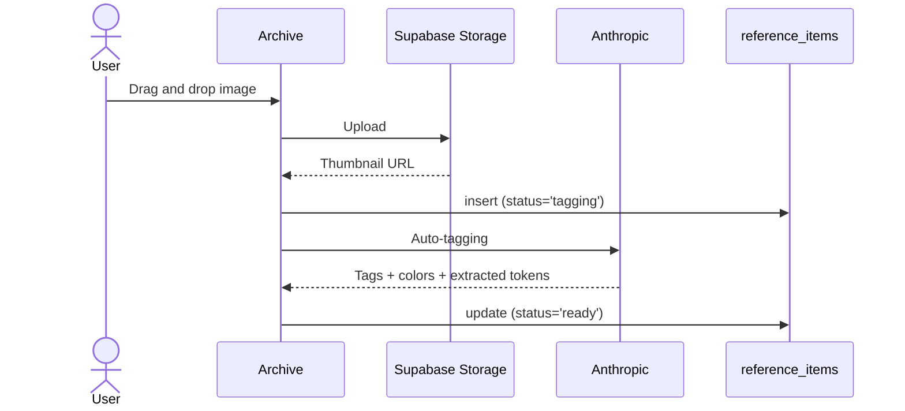
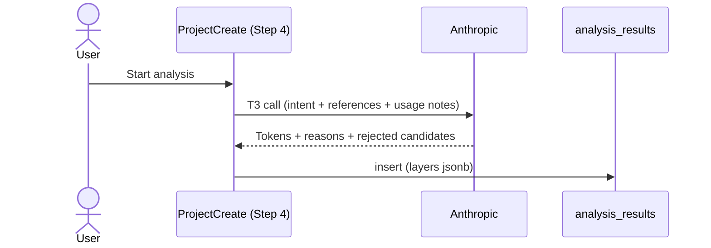
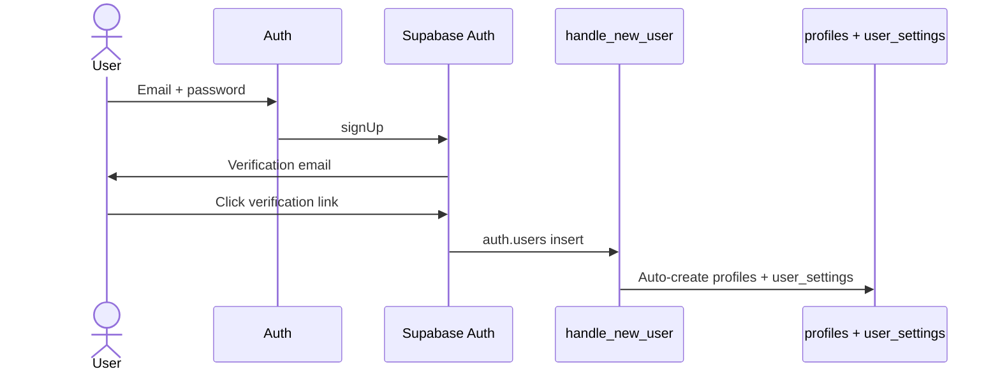

# MUSE. Data Bridge

> Explains how the ux-flow data model connects to Supabase.
> Columns / constraints / SQL live in [`appendix-db-schema.md`](./appendix-db-schema.md).

**Input**: [02-ux-flow.md § Using the Data Model](./02-ux-flow.md)

## 1. Which DB Tables Do the Data Models Become?

Quotes the ux-flow dictionary verbatim. A 1:1 mapping of which Supabase table each data name is stored in.

| Data Name | Expected Table Name | Description (one line) |
|---|---|---|
| `Reference` | `reference_items` | Inspiration images the user collected |
| `Project` | `projects` | A bundle of intent + mode + reference curation |
| `ProjectReference` | `project_references` | Which references a project uses for which layer (M:N) |
| `AnalysisResult` | `analysis_results` | The bundle of design tokens the AI produced |
| `UserSettings` | `user_settings` | Per-user AI model / storage / theme |
| `User` | `auth.users` (built into Supabase) | Registered user |

## 1.5. DB Spec Preview (brief)

> One line per column per table. Constraints, indexes, policies, and triggers are in [`appendix-db-schema.md`](./appendix-db-schema.md). Types use standard PG notation.

### `reference_items`

| Column | Type | null | Description |
|---|---|---|---|
| `owner_id` | uuid (-> auth.users.id) | ✗ | Owner |
| `source` | text | ✗ | file / url |
| `thumbnail_url` | text | ✗ | Thumbnail URL or data URI |
| `title` | text | ✓ | User-defined title |
| `tags` | jsonb | ✓ | Tag bundle by layer |
| `dominant_colors` | text[] | ✓ | Dominant color HEX values |
| `extracted` | jsonb | ✓ | Observed values extracted by T1 |

Automatic: `id` (uuid PK), `created_at`

### `projects`

| Column | Type | null | Description |
|---|---|---|---|
| `owner_id` | uuid (-> auth.users.id) | ✗ | Owner |
| `name` | text | ✗ | Project name |
| `mode` | text | ✗ | concept / system |
| `intent` | text | ✓ | One-line intent |
| `user_notes` | text | ✓ | Step 3 usage notes |
| `reference_notes` | jsonb | ✓ | refId -> text |

Automatic: `id`, `created_at`, `updated_at`

> The `referenceIds` field is split out into the `project_references` table. There is no such column on `projects`.

### `project_references`

| Column | Type | null | Description |
|---|---|---|---|
| `project_id` | uuid (-> projects.id) | ✗ | Owning project |
| `reference_id` | uuid (-> reference_items.id) | ✗ | Curated reference |
| `use_layers` | text[] | ✓ | List of layers to use |

Automatic: `id`

> No `owner_id`. RLS goes through `project_id -> projects.owner_id`.

### `analysis_results`

| Column | Type | null | Description |
|---|---|---|---|
| `project_id` | uuid (-> projects.id) | ✗ | Owning project |
| `status` | text | ✗ | pending / running / done / error |
| `layers` | jsonb | ✗ | All 5-layer tokens (including isEnabled / emphasis) |

Automatic: `id`, `updated_at`

> Token edits (isEnabled / emphasis) are partial updates to the `layers` jsonb.

### `user_settings`

| Column | Type | null | Description |
|---|---|---|---|
| `ai_model` | text | ✗ | T1/T2/T3 AI model name |
| `storage_mode` | text | ✗ | local / cloud |
| `theme_mode` | text | ✗ | light / dark / system |
| `is_auto_tag_enabled` | boolean | ✗ | Whether auto-tagging is on |

Automatic: `id` (= auth.users.id, 1:1 mapping)

### `profiles`

> ⚠️ Not registered in the ux-flow dictionary. For storing `User.displayName` / `User.avatarUrl`. Adding it to the dictionary is discussed in Phase 2.

| Column | Type | null | Description |
|---|---|---|---|
| `display_name` | text | ✓ | Display name shown in the GNB |
| `avatar_url` | text | ✓ | Profile image URL |

Automatic: `id` (= auth.users.id)

## 2. At Which Points in the UX-flow Does the DB Update?

Following the step-by-step ux-flow narrative, showing which table changes at each step.

### Scenario 1. Reference Archiving

- **Image upload** (Archive) -> `reference_items` insert (status='tagging'). The image itself is stored in the `references` bucket of Supabase Storage.
- **Auto-tagging complete** -> update the same row (fills tags / dominant_colors / extracted, status='ready'). Reflects the Anthropic vision response.

### Scenario 2. 5-step Project Creation

- **Step 0 mode selection** (ProjectCreate) -> `projects` insert (a row with only mode filled)
- **Step 1 title + intent** -> update the same `projects` row (name, intent)
- **Step 2 layer chip** -> for each selected reference, `project_references` insert/update (toggling use_layers). `reference_items` is R only.
- **Step 3 usage notes** -> `projects` row update (user_notes)
- **Step 4 AI analysis** -> `analysis_results` insert (stores the Anthropic response as a whole into the layers jsonb)

### Scenario 3. Token Review + Decision Tracing

- **Entering ProjectDetail** (ProjectDetail) -> `analysis_results` + `projects` + `reference_items` all R only.
- **on/off + emphasis editing** -> `analysis_results` row update (the isEnabled / emphasis fields of the layers jsonb)

### Scenario 4. Export

- **No DB update**. `projects` + `analysis_results` + `reference_items` are all read only to build the ZIP bundle.

### Sign-up Flow (outside the scenarios)

- **Auth sign-up** (Auth) -> `auth.users` insert (Supabase Auth). At the same time, the `handle_new_user` trigger auto-creates default rows in `profiles` + `user_settings`.

## 3. Which DB Does Each Page Connect To?

A page-centric table. R = read, W = write (insert/update).

| Page | Tables Handled | Actions |
|---|---|---|
| Auth | `auth.users` + `profiles` + `user_settings` | W (auto-created on sign-up) |
| Archive | `reference_items` | W (upload + auto-tagging) + R (grid) |
| ProjectList | `projects` | R |
| ProjectCreate | `projects` + `project_references` + `analysis_results` + `reference_items` | W (Steps 0-4) + R (reference selection) |
| ProjectDetail | `analysis_results` + `projects` + `reference_items` | R + `analysis_results` W when editing |
| Settings | `user_settings` | R + W |

## 4. Lifecycle of Externally Dependent Data

Only the asynchronous flows that involve external API / Storage / Auth. Sequences are omitted for simple CRUD data (`Project` / `ProjectReference` / `UserSettings`).

### Reference (Storage upload + Anthropic auto-tagging)

### AnalysisResult (Anthropic analysis)

### User (Supabase Auth + trigger)

## 5. Consistency Check

- [x] The data names and table names in § 1 match the ux-flow dictionary character for character
- [x] The steps in § 2 match the steps in the ux-flow step-by-step narrative
- [x] The page names in § 3 (Auth / Archive / ProjectList / ProjectCreate / ProjectDetail / Settings) match the rows of the ux-flow page list character for character
- [x] The external dependencies in the § 4 sequences (Storage / Anthropic / Supabase Auth) match the triggers in the ux-flow step-by-step narrative
- [x] Zero SQL/column/constraint/hook code in the body (if any, it is split out into [appendix-db-schema.md](./appendix-db-schema.md))
