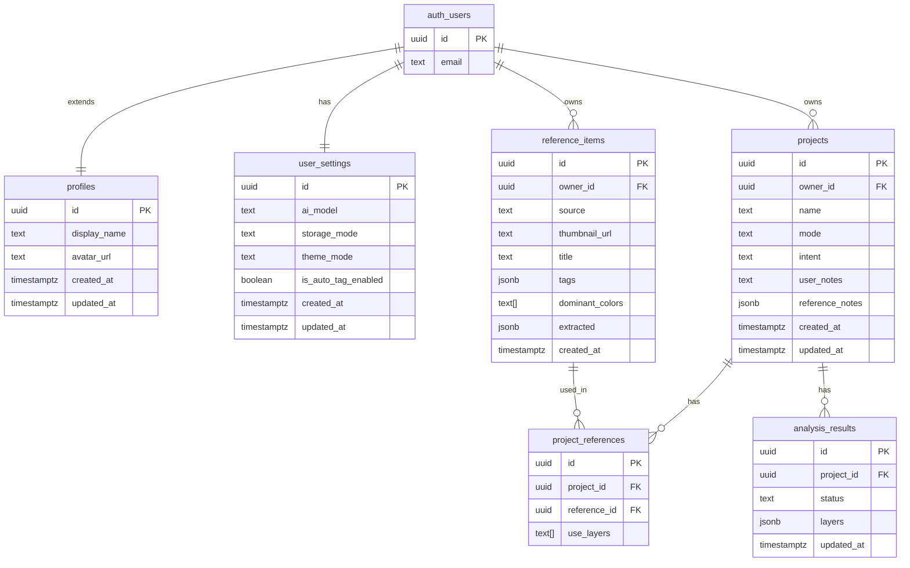

# appendix. DB Schema (MUSE)

> The main document is [`04-data-bridge.md`](./04-data-bridge.md). For the agreed column set, see `§ 1.5 DB Spec Preview`.
> This appendix is for the developer domain. It includes the full DDL, constraints, triggers, and indexes.

## Overview

- Project: MUSE
- Total tables: 6 (`profiles`, `user_settings`, `reference_items`, `projects`, `project_references`, `analysis_results`)
- `auth.users`: built into Supabase (cannot be created directly)
- Deletion policy: Hard delete
- Written on: 2026-05-20
- Migration: `supabase/migrations/20260520120000_init_schema.sql`

## ERD

> `auth_users` = Supabase `auth.users` (dot notation is not allowed in mermaid).

## Table Details

### `profiles`

> Stores ux-flow `User.displayName` / `User.avatarUrl`. 1:1 with `auth.users`.
> ⚠️ Not yet registered in the ux-flow dictionary. After Phase 2 is complete, it must be added to the dictionary via `/project-planning`.

| Column | Type | Constraints | Description |
|---|---|---|---|
| `id` | uuid | PK, FK -> auth.users.id ON DELETE CASCADE | User ID (same value) |
| `display_name` | text | NULLABLE | Display name shown in the GNB |
| `avatar_url` | text | NULLABLE | Profile image URL |
| `created_at` | timestamptz | NOT NULL DEFAULT now() | Creation time |
| `updated_at` | timestamptz | NOT NULL DEFAULT now() | Update time |

**Trigger**: `trg_profiles_set_updated_at` BEFORE UPDATE

---

### `user_settings`

> 1:1 with the user. id = auth.users.id.

| Column | Type | Constraints | Description |
|---|---|---|---|
| `id` | uuid | PK, FK -> auth.users.id ON DELETE CASCADE | User ID (same value) |
| `ai_model` | text | NOT NULL DEFAULT 'claude-sonnet-4-6' | T1/T2/T3 AI model name |
| `storage_mode` | text | NOT NULL DEFAULT 'local' | local / cloud |
| `theme_mode` | text | NOT NULL DEFAULT 'system' | light / dark / system |
| `is_auto_tag_enabled` | boolean | NOT NULL DEFAULT true | Whether auto tagging is enabled |
| `created_at` | timestamptz | NOT NULL DEFAULT now() | Creation time |
| `updated_at` | timestamptz | NOT NULL DEFAULT now() | Update time |

**Trigger**: `trg_user_settings_set_updated_at` BEFORE UPDATE

---

### `reference_items`

> Inspiration images collected by the user. No `updated_at` (auto tagging results are filled in with an update after the insert).

| Column | Type | Constraints | Description |
|---|---|---|---|
| `id` | uuid | PK DEFAULT gen_random_uuid() | |
| `owner_id` | uuid | NOT NULL, FK -> auth.users.id ON DELETE CASCADE | Owner |
| `source` | text | NOT NULL | file / url |
| `thumbnail_url` | text | NOT NULL | Thumbnail URL or data URI |
| `title` | text | NULLABLE | User specified title |
| `tags` | jsonb | NULLABLE | Tag groups per layer |
| `dominant_colors` | text[] | NULLABLE | Representative colors as HEX |
| `extracted` | jsonb | NULLABLE | Observed values extracted by T1 |
| `created_at` | timestamptz | NOT NULL DEFAULT now() | Creation time |

**Index**: `idx_reference_items_owner_id` ON (owner_id)

---

### `projects`

| Column | Type | Constraints | Description |
|---|---|---|---|
| `id` | uuid | PK DEFAULT gen_random_uuid() | |
| `owner_id` | uuid | NOT NULL, FK -> auth.users.id ON DELETE CASCADE | Owner |
| `name` | text | NOT NULL | Project name |
| `mode` | text | NOT NULL | concept / system |
| `intent` | text | NULLABLE | One line intent |
| `user_notes` | text | NULLABLE | Step 3 usage notes |
| `reference_notes` | jsonb | NULLABLE | refId -> text |
| `created_at` | timestamptz | NOT NULL DEFAULT now() | Creation time |
| `updated_at` | timestamptz | NOT NULL DEFAULT now() | Update time |

**Index**: `idx_projects_owner_id` ON (owner_id)
**Trigger**: `trg_projects_set_updated_at` BEFORE UPDATE

---

### `project_references`

> M:N join table. No `owner_id`. RLS goes through `project_id -> projects.owner_id`.

| Column | Type | Constraints | Description |
|---|---|---|---|
| `id` | uuid | PK DEFAULT gen_random_uuid() | |
| `project_id` | uuid | NOT NULL, FK -> projects.id ON DELETE CASCADE | Parent project |
| `reference_id` | uuid | NOT NULL, FK -> reference_items.id ON DELETE CASCADE | Curated reference |
| `use_layers` | text[] | NULLABLE | List of layers to use |

**Index**: `idx_project_references_project_id` / `idx_project_references_reference_id`
**Unique**: `(project_id, reference_id)` to prevent duplicates

---

### `analysis_results`

> The `layers` jsonb stores all 5 layer tokens. Token edits perform a partial jsonb update.

| Column | Type | Constraints | Description |
|---|---|---|---|
| `id` | uuid | PK DEFAULT gen_random_uuid() | |
| `project_id` | uuid | NOT NULL, FK -> projects.id ON DELETE CASCADE | Parent project |
| `status` | text | NOT NULL DEFAULT 'pending' | pending / running / done / error |
| `layers` | jsonb | NOT NULL DEFAULT '{}' | All 5 layer tokens |
| `updated_at` | timestamptz | NOT NULL DEFAULT now() | Update time |

**Index**: `idx_analysis_results_project_id` ON (project_id)
**Trigger**: `trg_analysis_results_set_updated_at` BEFORE UPDATE

---

## Common Rules

- All PKs: `uuid default gen_random_uuid()` (`profiles` / `user_settings` reference `auth.users.id` directly)
- Tables with `updated_at`: the `set_updated_at()` trigger must be attached
- Deletion policy: Hard delete. FK `ON DELETE CASCADE` performs cascading deletes.
- No `varchar(n)`. Use `text`.
- No `timestamp`. Use `timestamptz`.
- Explicit schema: always prefix with `public.`.

## Migration Path

| File | Phase | Contents |
|---|---|---|
| `20260520120000_init_schema.sql` | 1 | All tables + trigger functions + indexes |
| `20260520120100_auth_profiles.sql` | 2 | `handle_new_user` trigger |
| `20260520120200_rls_policies.sql` | 3 | All RLS policies |
