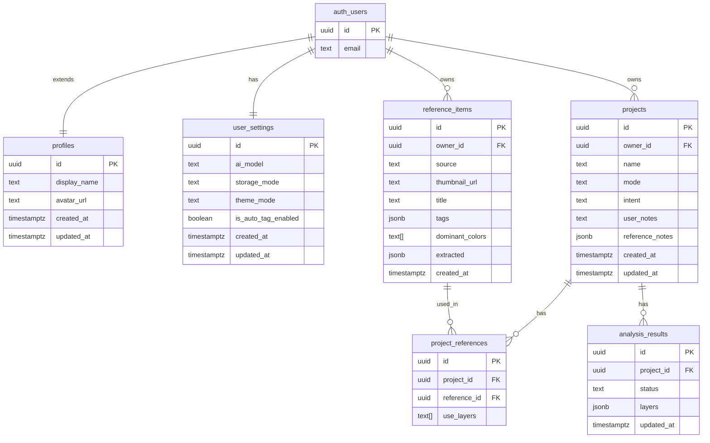

# appendix. DB Schema (MUSE)

> 본문은 [`04-data-bridge.md`](./04-data-bridge.md). 컬럼 합의는 `§ 1.5 DB 스펙 미리보기` 참조.
> 이 부록은 개발자 영역. DDL / 제약 / 트리거 / 인덱스 전체 포함.

## 개요

- 프로젝트: MUSE
- 총 테이블: 6 (`profiles`, `user_settings`, `reference_items`, `projects`, `project_references`, `analysis_results`)
- `auth.users`: Supabase 내장 (직접 생성 불가)
- 삭제 정책: Hard delete
- 작성일: 2026-05-20
- 마이그레이션: `supabase/migrations/20260520120000_init_schema.sql`

## ERD

> `auth_users` = Supabase `auth.users` (mermaid 에서 점 표기 불가).

## 테이블 상세

### `profiles`

> ux-flow `User.displayName` / `User.avatarUrl` 저장. `auth.users` 와 1:1.
> ⚠️ ux-flow 사전 미등록. Phase 2 완료 후 `/project-planning` 으로 사전 추가 필요.

| 컬럼 | 타입 | 제약 | 설명 |
|---|---|---|---|
| `id` | uuid | PK, FK → auth.users.id ON DELETE CASCADE | 사용자 ID (동일) |
| `display_name` | text | NULLABLE | GNB 표시 이름 |
| `avatar_url` | text | NULLABLE | 프로필 이미지 URL |
| `created_at` | timestamptz | NOT NULL DEFAULT now() | 생성 시각 |
| `updated_at` | timestamptz | NOT NULL DEFAULT now() | 수정 시각 |

**트리거**: `trg_profiles_set_updated_at` BEFORE UPDATE

---

### `user_settings`

> 사용자 1:1. id = auth.users.id.

| 컬럼 | 타입 | 제약 | 설명 |
|---|---|---|---|
| `id` | uuid | PK, FK → auth.users.id ON DELETE CASCADE | 사용자 ID (동일) |
| `ai_model` | text | NOT NULL DEFAULT 'claude-sonnet-4-6' | T1/T2/T3 AI 모델명 |
| `storage_mode` | text | NOT NULL DEFAULT 'local' | local / cloud |
| `theme_mode` | text | NOT NULL DEFAULT 'system' | light / dark / system |
| `is_auto_tag_enabled` | boolean | NOT NULL DEFAULT true | 자동 태깅 여부 |
| `created_at` | timestamptz | NOT NULL DEFAULT now() | 생성 시각 |
| `updated_at` | timestamptz | NOT NULL DEFAULT now() | 수정 시각 |

**트리거**: `trg_user_settings_set_updated_at` BEFORE UPDATE

---

### `reference_items`

> 사용자가 모은 영감 이미지. `updated_at` 없음 (자동 태깅 결과는 insert 후 update 로 채움).

| 컬럼 | 타입 | 제약 | 설명 |
|---|---|---|---|
| `id` | uuid | PK DEFAULT gen_random_uuid() | |
| `owner_id` | uuid | NOT NULL, FK → auth.users.id ON DELETE CASCADE | 소유자 |
| `source` | text | NOT NULL | file / url |
| `thumbnail_url` | text | NOT NULL | 썸네일 URL 또는 data URI |
| `title` | text | NULLABLE | 사용자 지정 제목 |
| `tags` | jsonb | NULLABLE | 레이어별 태그 묶음 |
| `dominant_colors` | text[] | NULLABLE | 대표 색 HEX |
| `extracted` | jsonb | NULLABLE | T1 추출 관찰 값 |
| `created_at` | timestamptz | NOT NULL DEFAULT now() | 생성 시각 |

**인덱스**: `idx_reference_items_owner_id` ON (owner_id)

---

### `projects`

| 컬럼 | 타입 | 제약 | 설명 |
|---|---|---|---|
| `id` | uuid | PK DEFAULT gen_random_uuid() | |
| `owner_id` | uuid | NOT NULL, FK → auth.users.id ON DELETE CASCADE | 소유자 |
| `name` | text | NOT NULL | 프로젝트 이름 |
| `mode` | text | NOT NULL | concept / system |
| `intent` | text | NULLABLE | 한 줄 의도 |
| `user_notes` | text | NULLABLE | Step 3 활용 노트 |
| `reference_notes` | jsonb | NULLABLE | refId → 텍스트 |
| `created_at` | timestamptz | NOT NULL DEFAULT now() | 생성 시각 |
| `updated_at` | timestamptz | NOT NULL DEFAULT now() | 수정 시각 |

**인덱스**: `idx_projects_owner_id` ON (owner_id)
**트리거**: `trg_projects_set_updated_at` BEFORE UPDATE

---

### `project_references`

> M:N 조인 테이블. `owner_id` 없음. RLS 는 `project_id → projects.owner_id` 경유.

| 컬럼 | 타입 | 제약 | 설명 |
|---|---|---|---|
| `id` | uuid | PK DEFAULT gen_random_uuid() | |
| `project_id` | uuid | NOT NULL, FK → projects.id ON DELETE CASCADE | 소속 프로젝트 |
| `reference_id` | uuid | NOT NULL, FK → reference_items.id ON DELETE CASCADE | 큐레이션된 레퍼런스 |
| `use_layers` | text[] | NULLABLE | 활용할 레이어 목록 |

**인덱스**: `idx_project_references_project_id` / `idx_project_references_reference_id`
**유니크**: `(project_id, reference_id)` 중복 방지

---

### `analysis_results`

> `layers` jsonb 에 5 레이어 토큰 전체 저장. 토큰 편집 시 jsonb 부분 업데이트.

| 컬럼 | 타입 | 제약 | 설명 |
|---|---|---|---|
| `id` | uuid | PK DEFAULT gen_random_uuid() | |
| `project_id` | uuid | NOT NULL, FK → projects.id ON DELETE CASCADE | 소속 프로젝트 |
| `status` | text | NOT NULL DEFAULT 'pending' | pending / running / done / error |
| `layers` | jsonb | NOT NULL DEFAULT '{}' | 5 레이어 토큰 전체 |
| `updated_at` | timestamptz | NOT NULL DEFAULT now() | 수정 시각 |

**인덱스**: `idx_analysis_results_project_id` ON (project_id)
**트리거**: `trg_analysis_results_set_updated_at` BEFORE UPDATE

---

## 공통 규칙

- 모든 PK: `uuid default gen_random_uuid()` (`profiles` / `user_settings` 는 `auth.users.id` 직접 참조)
- `updated_at` 있는 테이블: `set_updated_at()` 트리거 반드시 부착
- 삭제 정책: Hard delete. FK `ON DELETE CASCADE` 로 연쇄 삭제.
- `varchar(n)` 금지. `text` 사용.
- `timestamp` 금지. `timestamptz` 사용.
- 스키마 명시: `public.` 항상 붙임.

## 마이그레이션 경로

| 파일 | Phase | 내용 |
|---|---|---|
| `20260520120000_init_schema.sql` | 1 | 전체 테이블 + 트리거 함수 + 인덱스 |
| `20260520120100_auth_profiles.sql` | 2 | `handle_new_user` 트리거 |
| `20260520120200_rls_policies.sql` | 3 | RLS 정책 전체 |
